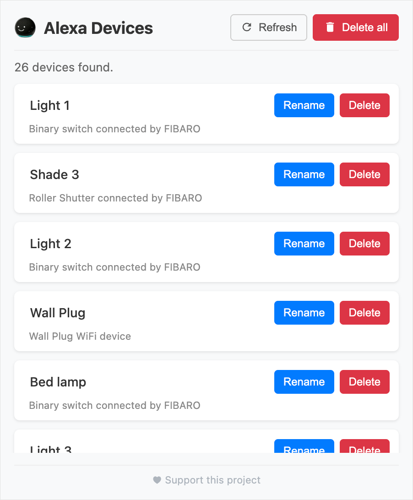

# Alexa Device Manager

A Chrome extension for managing your Amazon Alexa devices directly from the browser. List, rename, and delete devices without navigating through Amazon's native UI.

<p align="center">
   
</p>

## Features

- **List Devices** — View all Alexa-connected devices with their name, description, and manufacturer
- **Rename Devices** — Inline rename with a single click
- **Delete Devices** — Remove individual devices or bulk-delete all at once
- **Refresh** — Re-fetch the device list at any time

## Installation

1. Clone or download this repository:
   ```bash
   git clone https://github.com/pklatka/alexa-device-manager.git
   ```
2. Open **chrome://extensions** in your browser.
3. Enable **Developer mode** (toggle in the top-right corner).
4. Click **Load unpacked** and select the project folder.

## Usage

1. Navigate to [alexa.amazon.com](https://alexa.amazon.com) and log in.
2. Click the **Alexa Device Manager** extension icon in the toolbar.
3. Your devices will be fetched and displayed automatically.
4. Use the **Rename** / **Delete** buttons on each device card, or **Delete all** to remove every device.


## How It Works

The extension injects a content script into `alexa.amazon.com` pages. When the popup is opened, it sends messages to the content script which then calls Amazon's internal endpoints:

| Action  | Endpoint                              | Method |
| ------- | ------------------------------------- | ------ |
| Fetch   | `/nexus/v1/graphql` (GraphQL)         | POST   |
| Rename  | `/api/phoenix/alias`                  | POST   |
| Delete  | `/api/phoenix/appliance/{applianceId}` | DELETE |

Authentication is handled transparently via the user's existing Amazon session cookies.

## Permissions

| Permission   | Reason                                                     |
| ------------ | ---------------------------------------------------------- |
| `activeTab`  | Access the currently active tab to check if it's on Amazon |
| `scripting`  | Inject the content script into Alexa pages                 |

## License

This project is licensed under the [MIT License](LICENSE).
