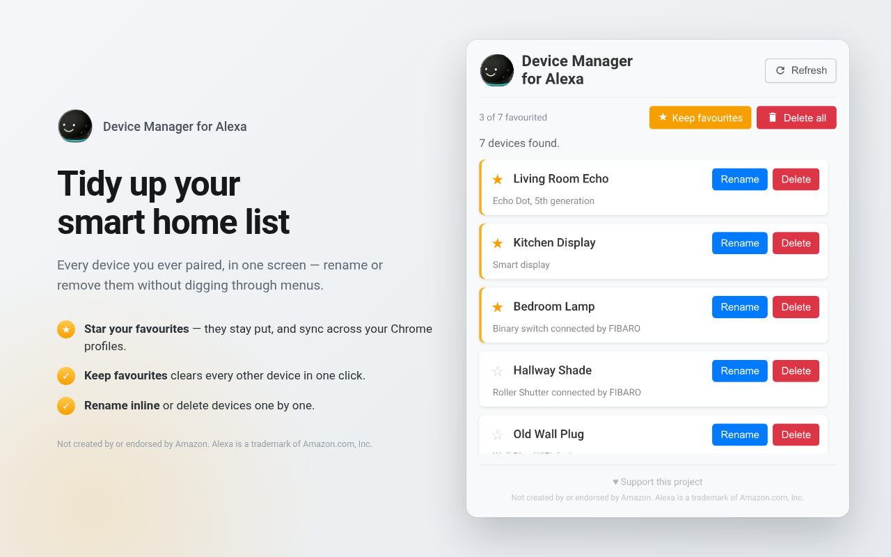

# Device Manager for Alexa

A Chrome extension for managing your Amazon Alexa devices directly from the browser. List, rename, and delete devices without navigating through Amazon's native UI.

> **Not created by or endorsed by Amazon.** Alexa, Echo and Amazon are trademarks of
> Amazon.com, Inc. or its affiliates. This is an independent, unofficial tool.

   

## Features

- **List Devices** — View all Alexa-connected devices with their name, description, and manufacturer
- **Rename Devices** — Inline rename with a single click
- **Delete Devices** — Remove individual devices or bulk-delete all at once
- **Favourites** — Star the devices you want to protect, synced across your Chrome profiles
- **Keep favourites** *(Pro)* — Delete every device *except* your favourites, in one click
- **Refresh** — Re-fetch the device list at any time

**Keep favourites** is a one-time **$4.99** unlock — no subscription. Everything else is free.

## Installation

Install from the
[Chrome Web Store](https://chromewebstore.google.com/detail/fogcopaameafjdpbbdoagfeinmdlodij?utm_source=item-share-cb).

## Usage

1. Navigate to [alexa.amazon.com](https://alexa.amazon.com) and log in.
2. Click the **Device Manager for Alexa** extension icon in the toolbar.
3. Your devices will be fetched and displayed automatically.
4. Use the **Rename** / **Delete** buttons on each device card, or **Delete all** to remove every device.
5. Click the **☆** on any device to mark it a favourite, then use **Keep favourites** to delete
   everything else. The button stays disabled until at least one device is starred, so it can
   never be used to wipe the whole list by accident.

## How It Works

The extension adds a content script to `alexa.amazon.com`. When you open the popup, it asks that
script to talk to Alexa on your behalf from within the page you already have open, reusing your
existing Amazon session — the extension never sees or stores your Amazon credentials.

It relies on interfaces Amazon does not publish or support. Amazon can change them at any time
without notice, which would break the extension until it is updated.

## Permissions

| Permission                   | Reason                                                     |
| ---------------------------- | ---------------------------------------------------------- |
| `activeTab`                  | Check whether the current tab is on Alexa                  |
| `storage`                    | Remember your favourites and your licence status           |
| `https://extensionpay.com/*` | Confirm a Pro purchase                                     |

## Privacy

- Your device list is read and modified inside the Alexa tab you already have open. It is not sent
  anywhere else.
- Favourites are stored in Chrome's own extension storage and sync with your Chrome profile.
- No analytics, tracking, or telemetry of any kind.
- The only third-party request is the Pro licence check to `extensionpay.com`.

## Source

The extension source lives in a **private** submodule, so `git clone --recurse-submodules` on this
repository will not fetch it unless you have access. This repo holds the store artwork and project
documentation.

Found a bug or have a feature request? Please
[open an issue](https://github.com/pklatka/alexa-device-manager/issues).

## Support

If this saved you some clicking, you can
[sponsor the project](https://github.com/sponsors/pklatka).

## License

This project is licensed under the [MIT License](LICENSE).
